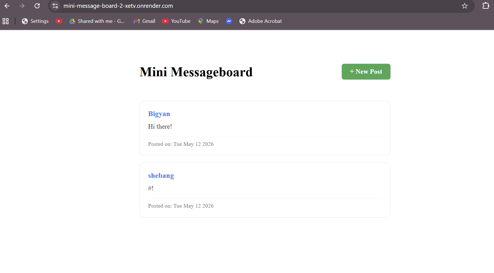
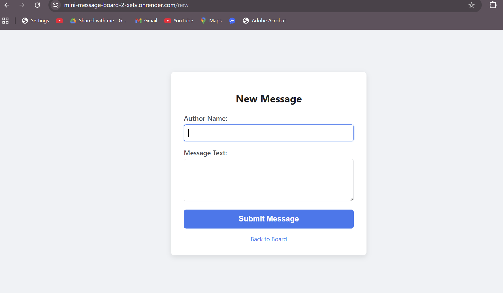

# Mini Messageboard 

A simple, real-time message board application built as part of The Odin Project curriculum. This project demonstrates the fundamentals of Node.js, Express, and EJS templating.

##  Features
- **View Messages:** A clean feed displaying user messages with timestamps.
- **Post Messages:** A dedicated form to add new messages to the board.
- **Dynamic Routing:** Utilizes Express Router for clean URL management.
- **EJS Templating:** Server-side rendering for a seamless user experience.

##  Tech Stack
- **Backend:** Node.js, Express.js
- **Frontend:** EJS (Embedded JavaScript), CSS3
- **Dev Tools:** Nodemon

##  Installation & Setup

1. **Clone the repository:**
   ```bash
   git clone [https://github.com/your-username/mini-messageboard.git](https://github.com/your-username/mini-messageboard.git)

## Screenshot


